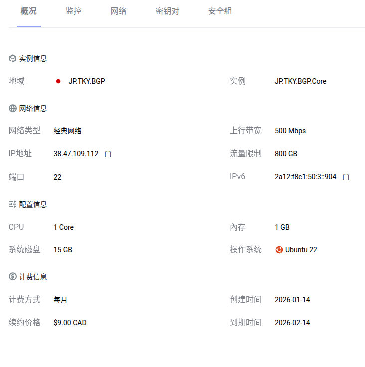

# 搭建自己的节点

因为用习惯了机场想搭建自己的节点试一试看看能不能省钱而且质量更高结果我的45块钱一个月的节点也就那样还不如我的66块3个月的机场好

## 1.挑选vps

搭建自己的节点必须选一个合适的Vps但是我第一部就选错了,我就选了[vmiss](https://app.vmiss.com/)的Bgp花了我45块大洋但是它对中国的通信不怎么友好,可能也是我的搭建模式错误
建议大家有钱就选[搬瓦工](https://bandwagonhost.com/)的主机,

## 2.挑选协议

我用的是vmess+reality就是利用https且伪装别人的特性比如`微软,苹果,特斯拉`让GFW无法勘探,就算感觉你的流量不正常,GFW也不敢封禁接下来我不敢深度研究了建议看

<iframe width="100%" height="468" src="https://www.youtube.com/watch?v=DO1_C9YWOYY" title="平凡的一天" frameborder="0" allowfullscreen></iframe>

如果不能访问youtube建议看[博客](https://v2rayssr.com/reality.html)建议用魔法看

## 测试

建议使用github的[开源项目](https://github.com/spiritLHLS/ecs)测试但是我的vmiss对上海的测速非常慢我在湖南的下载速度只达到4mb/s

## 退款

没有退款成功END:今天浪费了我50块​

