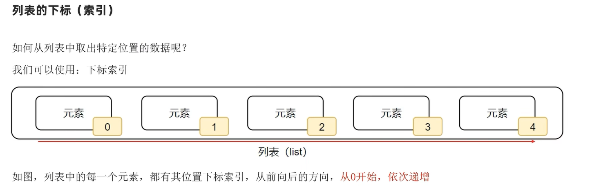
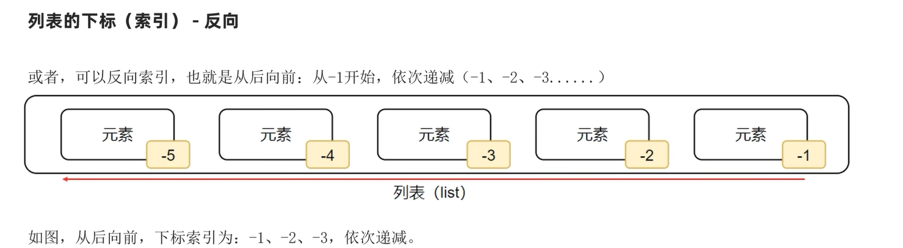
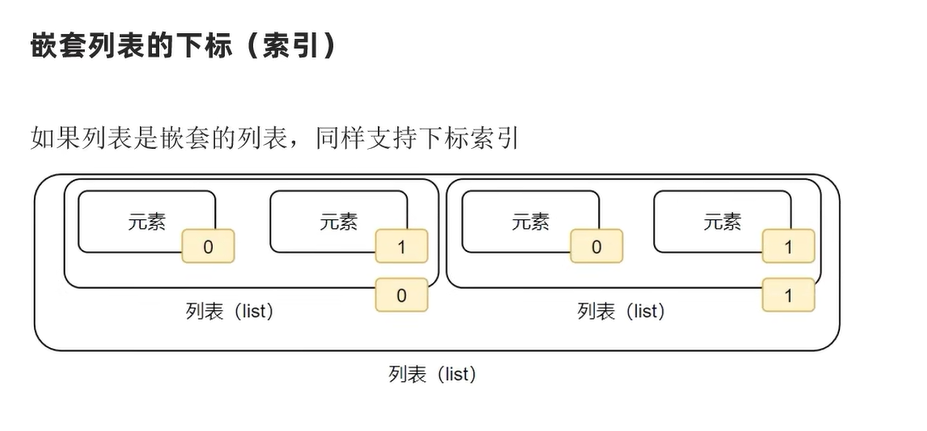
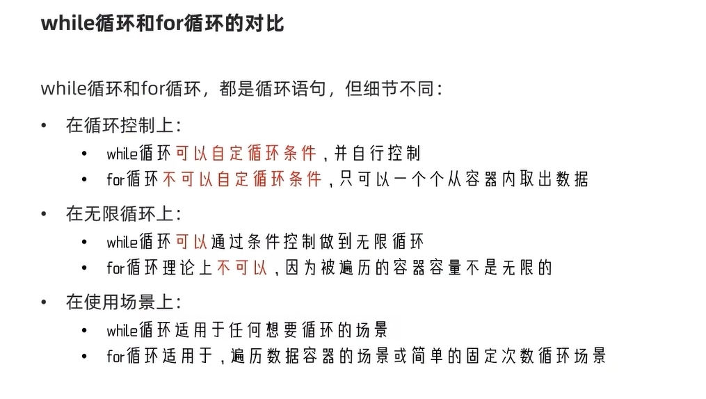
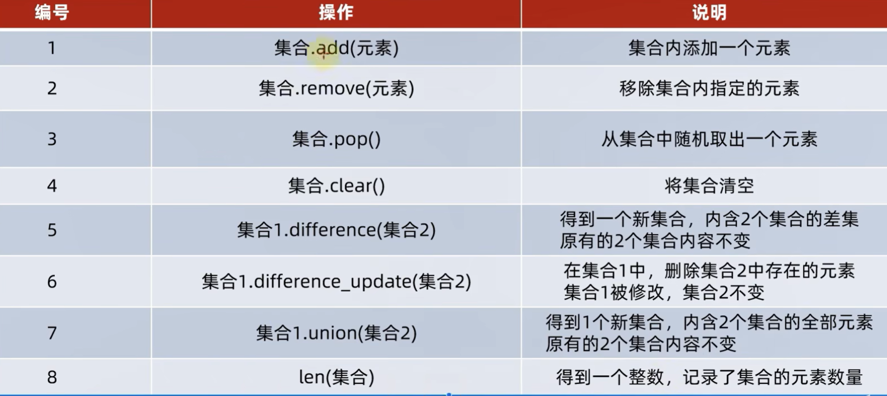

#  python的数据容器

Python中的数据容器：

一种可以容纳多份数据的数据类型，容纳的每一份数据称之为1个元素。每一个元素，可以是任意类型的数据，如字符串、数字、布尔等。

数据容器根据特点的不同，如：

是否支持重复元素

是否可以修改

是否有序，等

分为5类，分别是： `列表（list）`、`元组（tuple）`、`字符串（str）`、`集合（set）`、`字典（dict）`

## 列表

### 列表的定义语法

```
[元素1，元素2，元素3....]
```

什么是元素：
数据容器内的每一份数据，称之为元素
元素的类型有限制吗？：
元素的类型没有限制，元素也可是是列表，这就定义了嵌套列表

列表特点：

+ 可以容纳多个数据
+ 可以容纳不同类型的数据（混装）
+ 数据是有序存储的（下标索引）
+ 允许重复数据存在
+ 可以修改（增加或删除元素等）
+ 支持for循环







列表的基础语法：

```
# 字面量
[元素1，元素2，元素3....]
#定义变量
变量名称=[元素1，元素2，元素3....]
#定义空列表
变量名称=[]
变量名称=list()
```

比如：

```
name_list=[1,"nihao",True]
print(name_list)
print(type(name_list))
new_list=[name_list,[666,"nihao"]]
print(new_list)
print(type(new_list))
```

```
[1, 'nihao', True]
<class 'list'>
[[1, 'nihao', True], [666, 'nihao']]
<class 'list'>
```

### 列表的下表索引

列表每一个元素，都有编号称之为下表索引

通过下表索引取出对应位置元素：

简单索引：

```
name_list=[1,"nihao",True]
print(name_list[0],name_list[-3])
print(name_list[1],name_list[-2])
print(name_list[2],name_list[-1])
```

```
1 1
nihao nihao
True True
```

嵌套列表索引：

```
name_list=[[1,2,3],[4,5,6],[7,8,9]]
print(name_list[1][1])
```

```
5
```

==下表索引的注意事项：==
要注意下表索引的取值范围，超过范围无法去除元素，并且会报错

### 列表的常规操作

```
name_list=[1,2,3,4,5,6,7,8,9,10,11,12,13,14,15]
name_list[14]=16
print(name_list)
print(name_list.index(1))
name_list.insert(15,16)
print(name_list)
name_list.append(17)
print(name_list)
name_list.extend([18,19,20,21,22,23,24])
print(name_list)
name_list.pop(0)
print(name_list)
del name_list[0]
print(name_list)
```

```
[1, 2, 3, 4, 5, 6, 7, 8, 9, 10, 11, 12, 13, 14, 16]
0
[1, 2, 3, 4, 5, 6, 7, 8, 9, 10, 11, 12, 13, 14, 16, 16]
[1, 2, 3, 4, 5, 6, 7, 8, 9, 10, 11, 12, 13, 14, 16, 16, 17]
[1, 2, 3, 4, 5, 6, 7, 8, 9, 10, 11, 12, 13, 14, 16, 16, 17, 18, 19, 20, 21, 22, 23, 24]
[2, 3, 4, 5, 6, 7, 8, 9, 10, 11, 12, 13, 14, 16, 16, 17, 18, 19, 20, 21, 22, 23, 24]
[3, 4, 5, 6, 7, 8, 9, 10, 11, 12, 13, 14, 16, 16, 17, 18, 19, 20, 21, 22, 23, 24]
```

| 编号 | 使用方法                | 作用                                         |
| ---- | ----------------------- | -------------------------------------------- |
| 1    | 列表.append(元素)       | 像列表中追加一个元素                         |
| 2    | 列表.extend(容器)       | 将容器的内容依次取出，追加到列表尾部         |
| 3    | 列表.insert(下表，元素) | 在指定下标处，插入指定的元素                 |
| 4    | del 列表[下表]          | 删除列表指定的下标元素                       |
| 5    | 列表.pop(下标)          | 删除列表指定下标元素                         |
| 6    | 列表.remove(元素)       | 从前往后，删除此元素的第一个匹配项           |
| 7    | 列表.clear()            | 清空列表                                     |
| 8    | 列表.index(元素)        | 查找指定元素在列表的下表找不到报错ValueError |
| 9    | 列表.count()            | 统计此元素在列表中的出现次数                 |
| 10   | len(列表)               | 统计容器内有多少元素                         |

```python
num_list = [1, 2, 3, 4, 5, 6, 7, 8, 9, 10]
print(num_list.index(10))
num_list.append(10)
print(num_list)
num_list.extend([10])
print(num_list)
num_list.insert(-1,10)
print(num_list)
print(num_list.count(10))
print(len(num_list))
num=num_list[-1]
print(num)
del num_list[-1]
print(num_list)
num_list.pop(-1)
print(num_list)
num_list.remove(10)
print(num_list)
num_list.clear()
print(num_list)
```

```python
9
[1, 2, 3, 4, 5, 6, 7, 8, 9, 10, 10]
[1, 2, 3, 4, 5, 6, 7, 8, 9, 10, 10, 10]
[1, 2, 3, 4, 5, 6, 7, 8, 9, 10, 10, 10, 10]
4
13
10
[1, 2, 3, 4, 5, 6, 7, 8, 9, 10, 10, 10]
[1, 2, 3, 4, 5, 6, 7, 8, 9, 10, 10]
[1, 2, 3, 4, 5, 6, 7, 8, 9, 10]
[]
```

## 列表的循环遍历

遍历是将容器内的元素依次取出并处理，称之为遍历
如何经历列表的元素：可以使用while循环或者for循环

### while循环遍历

```
num_list=[1,2,3,4,5,6,7,8,9,10]
index=0
while index<len(num_list):
    print(num_list[index],end=' ')
    index+=1
```

```
1 2 3 4 5 6 7 8 9 10 
```

### for循环遍历

```
num_list=[1,2,3,4,5,6,7,8,9,10]
for num in num_list:
    print(num,end='')
```

```
12345678910
```



```
num_list=[1,2,3,4,5,6,7,8,9,10]
new_list=[]
index=0
while index<len(num_list):
    if num_list[index]%2==0:
        print(num_list[index])
        new_list.append(num_list[index])
    index+=1
print(new_list)
```

```
2
4
6
8
10
[2, 4, 6, 8, 10]
```

```
num_list=[1,2,3,4,5,6,7,8,9,10]
new_list=[]
for i in num_list:
    if i%2==0:
        new_list.append(i)
        print(i)
print(new_list)
```

```
2
4
6
8
10
[2, 4, 6, 8, 10]
```

## 元组

元组的定义语法：

```
（元素1，元素2，元素3...)
```

元组的基础语法：

```python
# 字面量
（元素1，元素2，元素3....)
#定义变量
变量名称=(元素1，元素2，元素3....)
#定义空列表
变量名称=()
变量名称=tuple()
```

注意：

定义单个元组：

```
变量名=（元素1，）
```

元组特点：

+ 可以容纳多个数据
+ 可以容纳不同类型的数据（混装）
+ 数据是有序存储的（下标索引）
+ 允许重复数据存在
+ 不可以修改（增加或删除元素等）
+ 支持for循环

元组操作方法：

| 函数      | 功能                                                         |
| --------- | ------------------------------------------------------------ |
| index()   | 查找某个数据，如果数据存在则返回对应的下标，数据不存在则报错 |
| count()   | 统计某个数据在当前元组出现的次数                             |
| len(元组) | 统计元组内的元素个数                                         |

```
name_tuple=(1,2,3,3,3,3)
print(name_tuple.index(1))
print(name_tuple.count(3))
print(len(name_tuple))
```

```
0
4
6
```

==元组的注意事项==
不可以修改内容（可以修改内部list的内部元素）

## 字符串的定义和操作

字符串为什么称之为数据容器：

字符串可以看作是字符的容器，支持下表索引等特性

字符串作为数据容器特点：

+ 只可存储字符串
+ 数据是有序存储的（下标索引）
+ 允许重复数据存在
+ 不可以修改（增加或删除元素等）
+ 支持for循环

  | 编号 | 操作                                              | 说明                                                         |
  | ---- | ------------------------------------------------- | ------------------------------------------------------------ |
  | 1    | 字符串[下标]                                      | 根据下表索引去除特定位置的字符                               |
  | 2    | 字符串.index(字符串)                              | 查找给定字符的第一个匹配的下标                               |
  | 3    | 新字符串=原字符串.replace(字符串1，字符串2)       | 将字符串内的全部字符串1，替换成字符串2(不会修改原字符串，而是将原字符串中的字符串1替换成字符串2并且得到新的字符串) |
  | 4    | 新字符串=原字符串.split()                         | 按照原字符串，对原字符串进行分割（不会修改原字符串，而是得到新的字符串） |
  | 5    | 新字符串=原字符串.strip()或原字符串.strip(字符串) | 移除首位的空格和换行符或strip中的指定字符串                  |
  | 6    | 字符串.count(字符串)                              | 统计字符串内某字符串的出现次数                               |
  | 7    | len(字符串)                                       | 统计字符串的字符个数                                         |

```
name="zhong chong wang"
index=0
while index<len(name):
    print(name[index],end=" ")
    index+=1
```

```
z h o n g   c h o n g   w a n g 
```

```
name="zhong chong wang"
for i in name:
    print(i,end=" ")
```

```
z h o n g   c h o n g   w a n g 
```

```
name="zhong chong wang"
new_str=name.replace(" ","!")
print(new_str)
print(name.count("ng"))
new2_str=new_str.split("!")
print(new2_str)
```

```
zhong!chong!wang
3
['zhong', 'chong', 'wang']
```

## 数据容器（序列）的切片

什么是序列：

内容连续、有序，支持下标索引的一类数据容器

 哪些数据容器可以视为序列：

列表、元组、字符串

序列如何做切片

序列[起始:结束:步长]

- 起始可以省略，省略从头开始
- 结束可以省略，省略到尾结束
- 步长可以省略，省略步长为1（可以为负数，表示倒序执行）

```
num=[0,1,2,3,4,5,6,7,8,9]
print(num[9:4:-1])
```

```
[9, 8, 7, 6, 5]
```

## 集合的定义和操作

集合的定义：

```
# 字面量
{元素1，元素2，元素3....}
#定义变量
变量名称={元素1，元素2，元素3....}
#定义空列表
变量名称=set()
```

集合的特点：

+ 集合不支持重复元素（去重）
+ 集合内元素是无顺序的(不支持下表索引)

字符串作为数据容器特点：

+ 可以容纳多个数据
+ 可以容纳不同类型的数据（混装）
+ ==数据是不是有序存储的（不支持下标索引）==
+ ==不允许重复数据存在==
+ ==可以修改（增加或删除元素等）==
+ 支持for循环==（不支持while循环）==

| 编号 | 操作                           | 说明                                                         |
| ---- | ------------------------------ | ------------------------------------------------------------ |
| 1    | 集合.add(元素)                 | 集合内添加一个元素                                           |
| 2    | 集合.remove(元素)              | 移除集合内指定的元素                                         |
| 3    | 集合.pop()                     | 从集合内随机取出一个元素                                     |
| 4    | 集合1.difference(集合2)        | 得到一个新的集合，内涵2个集合的差集原有的两个集合内容不变    |
| 5    | 集合.clear()                   | 将集合清空                                                   |
| 6    | 集合1.difference_update(集合2) | 在集合1中，删除集合2中存在的元素集合1被修改，集合2不变       |
| 7    | 集合1.union(集合2)             | 得到一个新的集合，内含2个集合的全部元素原有的2个集合内容不变 |
| 8    | len(集合)                      | 得到一个int，记录了集合的元素数量                            |



## 字典

为什么要用字典：
字典可以提供基于Key检索Value的场景实现
字典的定义语法：

```
# 字面量
{key:value，key:value，key:value....key:value}
#定义变量
变量名称={key:value，key:value，key:value....}
#定义空列表
my_dict={}
my_dict=dict()
```

==字典的注意事项==:

- 键值对的Key和Value可以是任意类型（Key不可为字典）
- 字典内Key不允许重复，重复添加等同于覆盖原有数据
- 字典不可用下标索引，而是通过Key检索Value

## 字典的常规操作

字典的特点：

+ 可以容纳多个数据
+ 可以容纳不同类型的数据（混装）
+ 不支持下标索引
+ 每一份数据都是`keyValue`键值对
+ 可以通过key获取value，key不可以重复（重复会覆盖）
+ 可以修改（增加或删除元素等）
+ 支持for循环，不支持value循环

字典的常规操作：

| 编号 | 操作            | 说明                                          |
| ---- | --------------- | --------------------------------------------- |
| 1    | 字典[key]       | 获取指定的key对应的Value值                    |
| 2    | 字典[key]=Value | 添加或更新键值对                              |
| 3    | 字典.pop(key)   | 取出key对应的value并在字典内删除此key的键值对 |
| 4    | 字典.clear()    | 清空字典                                      |
| 5    | len(字典)       | 计算字典内的元素数量                          |
| 6    | 字典.keys()     | 获取字典的全部key，可用于for循环遍历字典      |

注意：字典新增和更新语法一样，如何key不存在就是新增，key存在就是更新（key不可重复）

实例：

```
com_dict={"王力鸿":{"部门":"科技部","工资":3000,"级别":1},
          "周杰轮":{"部门":"市场部","工资":5000,"级别":2},
          "林俊节":{"部门":"市场部","工资":7000,"级别":3},
          "张学油":{"部门":"科技部","工资":4000,"级别":1},
          "刘德滑":{"部门":"市场部","工资":6000,"级别":2}}
print(com_dict)
for i in com_dict:
    if com_dict[i]["级别"]==1:
        com_dict[i]["级别"]=2
        com_dict[i]["工资"]+=1000
print(com_dict)
```

```
{
'王力鸿': {'部门': '科技部', '工资': 3000, '级别': 1},
'周杰轮': {'部门': '市场部', '工资': 5000, '级别': 2}, 
'林俊节': {'部门': '市场部', '工资': 7000, '级别': 3}, 
'张学油': {'部门': '科技部', '工资': 4000, '级别': 1}, 
'刘德滑': {'部门': '市场部', '工资': 6000, '级别': 2}}
{
'王力鸿': {'部门': '科技部', '工资': 4000, '级别': 2}, 
'周杰轮': {'部门': '市场部', '工资': 5000, '级别': 2},
'林俊节': {'部门': '市场部', '工资': 7000, '级别': 3}, 
'张学油': {'部门': '科技部', '工资': 5000, '级别': 2}, 
'刘德滑': {'部门': '市场部', '工资': 6000, '级别': 2}}
```

## 数据容器的比较分析

|              | 列表（list）                     | 元组（tuple)                       | 字符串(str)        | 集合(set)              | 字典(dict)                     |
| :----------- | :------------------------------- | :--------------------------------- | :----------------- | :--------------------- | :----------------------------- |
| **元素数量** | 支持多个                         | 支持多个                           | 支持多个           | 支持多个               | 支持多个                       |
| **元素类型** | 任意                             | 任意                               | 只支持字符         | 任意                   | key：不支持字典，value支持任意 |
| **下标索引** | 支持                             | 支持                               | 支持               | 不支持                 | 不支持                         |
| **重复元素** | 支持                             | 支持                               | 支持               | 不支持                 | 不支持                         |
| **可修改性** | 支持                             | 不支持                             | 不支持             | 支持                   | 支持                           |
| **数据有序** | 有序                             | 有序                               | 有序               | 无序                   | 无序                           |
| **使用场景** | 可修改、可重复的一批数据记录场景 | 不可修改、可重复的一批数据记录场景 | 一串字符的记录场景 | 不可重复的数据记录场景 | 以Key检索Value的数据记录场景   |

## 数据容器的通用操作

| 功能                            | 描述                                                         |
| ------------------------------- | ------------------------------------------------------------ |
| 通用For循环                     | 遍历容器(字典是遍历key)                                      |
| max()                           | 容器内最大元素                                               |
| min()                           | 容器内最小元素                                               |
| len()                           | 容器内元素个数                                               |
| list()                          | 转换成列表                                                   |
| tuple()                         | 转换成元组                                                   |
| str()                           | 转换成字符串                                                 |
| set()                           | 转换成集合                                                   |
| sorted(容器，[reverse=`Flase`]) | 排序，reverse=`Flase`是默认，表示升序;reverse=`True`表示降序都是得到一个排好的**序列** |

注意：字典用`list(）`，`tuple()`，`set()`都会都是value用`str()`不会丢失，不建议其他四个转字典

### 字符串大小的比较

字符串如何比较：
从头到尾，一位一位的进行比较，其中一位大，后边无序比较
单个字符如何确定大小：
通过ASC||码表,确认字符对应大码值数字来确定大小

# python函数进阶

## 函数的多返回值

```
def return_test():
    return  1,"二"
x,y = return_test()
print(x)# 结果1
print(y)# 结果2
```

按照返回值的顺序，写对应顺序的同等的变量接受即可
变量之间用逗号隔开
return支持不同的数据

## 函数多种的传参方式

### 位置参数

根据参数位置传递实际参数

```
def test(name,age,gender):
	print(name,age,gender)
test("xiaoming",10,"nan")
```

```
xiaoming 10 nan
```

### 关键字参数

通过"键=值"形式传递参数，可以不限参数顺序
**可已和位置参数混用，位置参数必须在前**

```
def test(name,age,gender):
	print(name,age,gender)
test("xiaoming",gender="male",age=20)
```

```
xiaoming 20 male
```

### 缺省参数

不传递实际参数值时会使用默认参数值
默认参数值必须定义在最后

```
def test(name,age=20,gender="male"):
	print(name,age,gender)
test("xiaoming")
test("xioamei",19,"female")
```

```
xiaoming 20 male
xioamei 19 female
```

### 不定长参数

#### 位置不定常长

位置不定长传递以*号标记一个形式参数，以元组形式接受实际参数，形式参数一般命名为`args`

```
def test(*args):
    print(f"args的数据是{args}，类型是{type(args)}")
test("xiaoming","20","male")
```

```
args的数据是('xiaoming', '20', 'male')，类型是<class 'tuple'>
```

#### 关键字不定长

关键字不定长传递以**号标记一个形式参数，以字典形式接受实际参数，形式参数一般命名为`kwargs`

```
def test(**kwargs):
    print(f"args的数据是{kwargs}，类型是{type(kwargs)}")
test(name="xiaoming",age="20",gender="male")
```

```
args的数据是{'name': 'xiaoming', 'age': '20', 'gender': 'male'}，类型是<class 'dict'>
```

## 函数作为参数传递

### 函数运行时，接受外部的数据进行计算（基础）

**计算逻辑确定，但是参数不确定**

```
def add(a,b):
    return a+b
add1 = add(1,2)
print(add1)
```

### 函数运行时，作为参数进行计算（扩展）

**参数确定，但是计算逻辑不确定**

```
def add_func(compute):
    result=compute(1,2)
    print(f"计算结果是{result}，compute的类型是{type(compute)}")
def compute(num1,num2):
    return num1+num2
add_func(compute)
```

```
计算结果是3，compute的类型是<class 'function'>
```

**函数本身可以作为参数，传入另一个函数中进行使用**
**将函数传入作用在于：传入计算逻辑，而非传入数据**

## 匿名函数：lambda

匿名函数使用lambda进行定义
定义语法：

```
lambda 传入参数：函数体
```

**传入参数是形参，函数体只能是一行代码，**

```
def add_func(compute):
    result=compute(1,2)
    print(f"计算结果是{result}，compute的类型是{type(compute)}")
add_func(lambda x,y:x+y)
```

```
计算结果是3，compute的类型是<class 'function'>
```

注意事项：

+ 匿名函数临时构建一个函数，只用一次的场景
+ 匿名函数的定义中，函数体只能写一行代码，如果函数体要写多行代码，不可以用lambda函数，建议使用def定义带名函数
